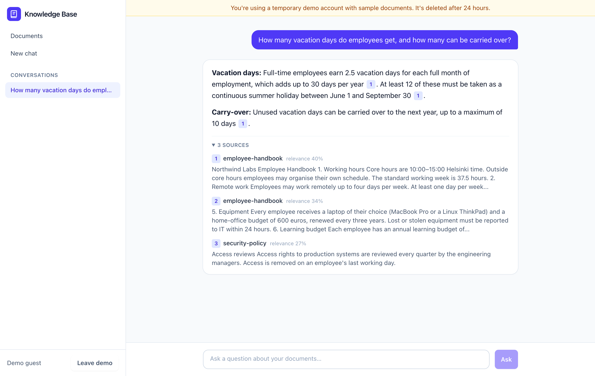
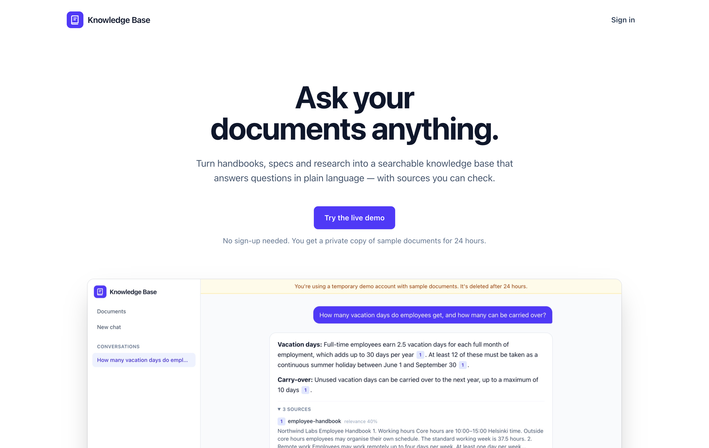
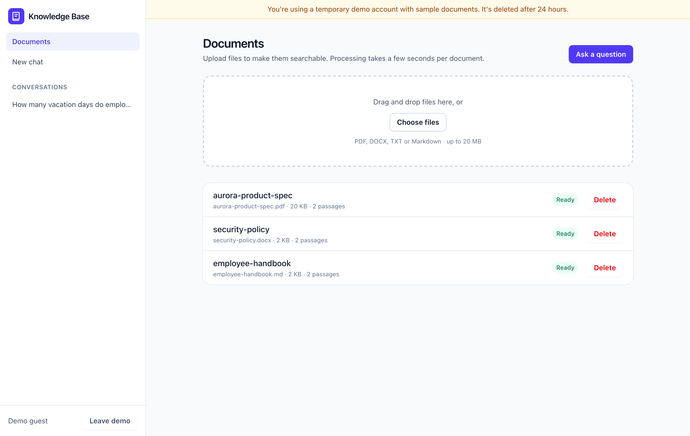

# AI Knowledge Base

Upload your documents and ask questions about them. Answers are generated by an LLM **grounded only in your own content**, with numbered citations linking back to the source passages.

**[Try the live demo →](https://ai-knowledge-base-template.pages.dev)** No sign-up: you get a private copy of sample documents (an employee handbook, a security policy and a product spec) for 24 hours. The demo runs on free hosting, so the first request after a quiet period can take up to a minute while the server wakes up.



- **Backend:** Laravel 13 API (PHP 8.3+), Sanctum token auth, queued ingestion, [`laravel/ai`](https://github.com/laravel/ai) for provider-agnostic LLM + embeddings
- **Frontend:** React 19 + TypeScript + Vite + Tailwind CSS 4 + TanStack Query
- **AI providers:** Anthropic Claude, OpenAI, Gemini, Mistral, **Ollama (local, free)** and more — switch with env vars
- **Quality gates:** Pest, Larastan (level 6), Pint, Vitest, oxlint, `tsc --strict`; GitHub Actions on SQLite **and** PostgreSQL

<table>
  <tr>
    <td></td>
    <td></td>
  </tr>
  <tr>
    <td align="center">Landing page</td>
    <td align="center">Document library: PDF, DOCX and Markdown</td>
  </tr>
</table>

## How it works

```
Upload ─▶ store file ─▶ ProcessDocument job (queue)
                          ├─ extract text (PDF / DOCX / TXT / MD)
                          ├─ split into overlapping ~1200-char chunks
                          ├─ embed chunks in batches
                          └─ save chunks + vectors ─▶ status: ready

Question ─▶ vector search (cosine) + keyword search (BM25) over the user's chunks
         ─▶ merge by reciprocal rank fusion ─▶ optional reranker ─▶ top-k
         ─▶ prompt LLM with numbered sources + recent chat history
         ─▶ answer streamed token-by-token (SSE) with [n] citations
         ─▶ citations verified against the sources, then persisted
```

- Every query is scoped to the authenticated user's documents. There's no cross-tenant retrieval, and tests cover this.
- If nothing relevant is found, the API answers without calling the LLM, which saves cost and avoids hallucinations.
- Citations are checked after generation (`CitationRepairer`). Each sentence is matched against the source passages by distinctive shared words and numbers. Wrong or non-existent source numbers are corrected, missing ones are added, and "not in the sources" sentences are left uncited. This matters most for small local models, which often get the facts right but the numbers wrong. Streamed text shows the model's raw citations until the answer completes.
- Retrieval is hybrid (`Retriever`). Vector search finds passages that mean the same thing in other words, and BM25 keyword search finds exact terms that embeddings blur: product codes, names, numbers ("IP54", "LTE-M", "1Password"). The two rankings are merged with reciprocal rank fusion. Without a reranker, a passage is kept if its vector score passes `KB_RETRIEVAL_MIN_SCORE` or it contains most of the question's distinctive terms. With a reranker (Jina, Cohere or Voyage AI), the reranker orders the merged candidates. If it fails or its free quota runs out, the answer still comes, ranked without it.
- Vectors are stored as compact float32 in the regular database (`DatabaseVectorStore`), so any database works with zero extra infrastructure. The `VectorStore` interface lets you swap in pgvector or Qdrant when you outgrow brute-force search (roughly tens of thousands of chunks per user).
- Each document records which embedding model indexed it, so switching models never compares incompatible vectors. Run `php artisan kb:reindex` after switching.

## Local development

### Requirements

| Tool | Version | macOS (MacPorts) |
|---|---|---|
| PHP | 8.3+ with `pdo_sqlite`, `mbstring`, `intl`, `zip`, `iconv` | `sudo port install php83 php83-sqlite php83-mbstring php83-intl php83-zip php83-iconv` |
| Composer | 2.x | see [getcomposer.org](https://getcomposer.org/download/) |
| Node.js | 20+ | `nvm install --lts` |

SQLite is used locally, so no database server is needed. Docker isn't required either.

### Setup

```bash
bin/setup          # installs deps, creates .env files, migrates the SQLite DB
```

Then configure an AI provider in `backend/.env` (see below) and start everything:

```bash
bin/dev            # API :8000 + queue worker + frontend :5173
```

Open http://localhost:5173 and create an account.

### Choosing an AI provider

**Option A: OpenAI (fast, cheapest).** Set `OPENAI_API_KEY` in `backend/.env`. The defaults use `gpt-6-luna` ($0.10 / $0.50 per million input/output tokens) and `text-embedding-3-small`.

> **Accounts without credit:** in testing (September 2026), an OpenAI account with no credit could still call `gpt-6-luna`, limited to **50 requests per day** and about 100,000 tokens per ~11 days. **Embeddings were refused** (`insufficient_quota`). Without credit, combine Luna for chat with local Ollama embeddings. Keep `KB_LIMIT_QUESTIONS_PER_DAY` below 50. When the provider's quota runs out, the app shows "The AI service has reached its usage limit for now" instead of an error. These limits are account- and promotion-specific; check the response headers or your OpenAI dashboard.

**Option B: fully local with Ollama (free and private, slower).**

```bash
sudo port install ollama        # or download from ollama.com
OLLAMA_KEEP_ALIVE=30m ollama serve &
ollama pull nomic-embed-text    # embeddings (~270 MB)
ollama pull qwen2.5:3b          # chat model (~2 GB)
```

```dotenv
KB_EMBEDDINGS_PROVIDER=ollama
KB_EMBEDDINGS_MODEL=nomic-embed-text
KB_EMBEDDINGS_QUERY_PREFIX="search_query: "
KB_EMBEDDINGS_DOCUMENT_PREFIX="search_document: "
KB_CHAT_PROVIDER=ollama
KB_CHAT_MODEL=qwen2.5:3b
KB_CHAT_TIMEOUT=300
# Similarity scores depend on the embedding model. nomic-embed-text scores
# unrelated text around 0.4-0.5, so the default of 0.2 lets everything through.
KB_RETRIEVAL_MIN_SCORE=0.5
```

> **Intel Macs:** Ollama tries to use the integrated Intel GPU through Metal and crashes (`GGML_ASSERT(buf_dst) failed`). Create CPU-only variants and use those model names instead:
>
> ```bash
> printf 'FROM nomic-embed-text\nPARAMETER num_gpu 0\n' > /tmp/Modelfile && ollama create nomic-embed-text-cpu -f /tmp/Modelfile
> printf 'FROM qwen2.5:3b\nPARAMETER num_gpu 0\n' > /tmp/Modelfile && ollama create qwen2.5-3b-cpu -f /tmp/Modelfile
> ```
>
> Measured on a 2017 MacBook Pro (i5, 8 GB, CPU only) with `qwen2.5:3b`:
>
> | Step | Time |
> |---|---|
> | Ingesting a short document | ~2–6 s |
> | Retrieval (embedding the question) | ~1.3 s |
> | First word of the answer | ~12–35 s |
> | Complete answer | ~25–55 s |
> | First question after models were unloaded | +40 s per model (process startup) |
>
> Start Ollama with `OLLAMA_KEEP_ALIVE=30m ollama serve` so models stay loaded between questions.
>
> Answers were factually correct in testing, and the model admitted when documents didn't cover a question. On its own, the 3B model cited correctly in none of 6 test answers: citations were wrong, pointed to non-existent sources, or were missing. After citation repair, all 13 cited sentences pointed to the passage containing the fact. That's a small sample; it's a heuristic, not a guarantee.

After changing embedding model or prefixes, run `php artisan kb:reindex`.

**Option C: Anthropic Claude (best answers).** Set `ANTHROPIC_API_KEY` plus:

```dotenv
KB_CHAT_PROVIDER=anthropic
KB_CHAT_MODEL=claude-opus-5-5   # $4 / $20 per million input/output tokens
KB_CHAT_EFFORT=medium           # Claude Opus 5.5's default; lower is faster and cheaper
KB_CHAT_FALLBACKS=default       # if Claude declines a request, retry it on Anthropic's recommended model
```

Measured on the sample evaluation: about 960 input and 140 output tokens per answer, so **about $0.007 per question** with Claude Opus 5.5 at `medium` effort, with answers in ~3.4 s. `php artisan kb:eval` reports token usage, so you can measure your own documents. Anthropic doesn't offer embeddings, so keep another embeddings provider (OpenAI or Ollama). If a request is declined even after the fallback, the partial text is discarded and the user sees "I can't answer this question…" instead of a truncated answer.

### Configuration

All settings are in `backend/config/knowledge.php` and can be overridden via env:

| Variable | Default | Purpose |
|---|---|---|
| `KB_CHAT_PROVIDER` / `KB_CHAT_MODEL` | `openai` / `gpt-6-luna` | Answer generation |
| `KB_EMBEDDINGS_PROVIDER` / `KB_EMBEDDINGS_MODEL` | `openai` / `text-embedding-3-small` | Vector embeddings |
| `KB_CHUNK_SIZE` / `KB_CHUNK_OVERLAP` | `1200` / `200` | Chunking (characters) |
| `KB_RETRIEVAL_TOP_K` / `KB_RETRIEVAL_MIN_SCORE` | `6` / `0.2` | Retrieval |
| `KB_RETRIEVAL_MODE` | `hybrid` | `hybrid` (vector + keyword) or `vector` |
| `KB_RERANK_PROVIDER` / `KB_RERANK_MODEL` | off | Optional reranker, e.g. `jina` / `jina-reranker-v2-base-multilingual` (needs `JINA_API_KEY`) |
| `KB_RERANK_MIN_SCORE` | none | Drop passages the reranker scores below this; unset = reorder only |
| `KB_UPLOAD_MAX_KB` | `20480` | Max upload size |
| `CORS_ALLOWED_ORIGINS` | `http://localhost:5173` | Frontend origin(s) |
| `SANCTUM_TOKEN_EXPIRATION` | `43200` (30 days) | API token lifetime, in minutes |

## Testing & quality

```bash
cd backend
vendor/bin/pest                  # tests (AI calls are faked, no keys needed)
vendor/bin/phpstan analyse       # static analysis
vendor/bin/pint                  # code style

cd ../frontend
npm test && npm run lint && npm run typecheck && npm run build
```

## Evaluating quality

`php artisan kb:eval` runs a dataset of questions with known answers through the real pipeline, using your configured models, and reports:

- **Retrieval:** Hit@1, Hit@k, MRR, and how many unanswerable questions retrieval already filters out
- **Answers:** fact recall, citation precision (did it cite the right document?), uncited answers, correct and false abstentions, chat model token usage
- **Latency:** p50 and max

```bash
cd backend
php artisan kb:eval --retrieval-only          # seconds; no chat model calls
php artisan kb:eval                           # full run with answers
php artisan kb:eval --no-repair               # measure the raw model's citations
php artisan kb:eval --json=results.json       # save results to compare runs
php artisan kb:eval path/to/dataset --limit=5
```

Each run ingests the dataset's documents under a throwaway user and deletes it, including stored files, afterwards. It uses your configured database, not a test database. A sample dataset is in `backend/evals/northwind/`. To build your own, add documents and a `cases.json`:

```json
{
  "name": "My docs",
  "documents": ["handbook.pdf", "faq.md"],
  "cases": [
    { "question": "How many vacation days?", "expect_documents": ["handbook"], "facts": ["30", ["10", "ten"]] },
    { "question": "What is the capital of France?", "unanswerable": true }
  ]
}
```

`expect_documents` uses file names without extensions. Each entry in `facts` must appear in the answer; an inner list means any of those alternatives counts. Use it after changing models, prompts, chunking or `KB_RETRIEVAL_MIN_SCORE`.

## API

All routes are prefixed with `/api`. Authenticated routes need `Authorization: Bearer <token>`.

| Method | Route | Description |
|---|---|---|
| GET | `/config` | Public settings: `{ demo, registration, limits }` |
| POST | `/auth/register`, `/auth/login` | Returns `{ token, user }` |
| POST | `/auth/guest` | Demo mode only: creates a guest account with the sample documents |
| GET / POST | `/auth/me`, `/auth/logout` | Current user / revoke token |
| GET / POST | `/documents` | List (filter `?status=`) / upload (`multipart: file`) |
| GET / DELETE | `/documents/{id}` | Show / delete (removes file and chunks) |
| POST | `/documents/{id}/reprocess` | Retry ingestion |
| POST | `/chat` | `{ question, conversation_id?, document_ids? }` → assistant message with `sources` |
| POST | `/chat/stream` | Same input; server-sent events: `sources` → `delta`… → `done` (saved message) or `error` |
| GET / DELETE | `/conversations`, `/conversations/{id}` | History |

Rate limits: auth 10/min per IP, uploads 30/min, chat 20/min per user.

## Deployment

### Free-tier setup ($0 hosting)

| Piece | Service | Free tier |
|---|---|---|
| API (Docker) | [Render](https://render.com) web service | Sleeps after 15 min idle (~1 min to wake), ephemeral disk |
| Database | [Neon](https://neon.com) Postgres | 0.5 GB, scales to zero, doesn't expire |
| Frontend | [Cloudflare Pages](https://pages.cloudflare.com) | Unlimited static traffic |

The **AI APIs are the only cost.** The blueprint uses Claude Opus 5.5 for answers and OpenAI for embeddings. Anthropic has no embeddings API, and Ollama can't run on the free tier. Both need prepaid credit; indexing the whole demo costs a fraction of a cent. Set a monthly spend limit in both consoles. The app also caps usage (below).

**1. Database: Neon**

Create a project in **AWS Europe Central (Frankfurt)**, the same region as the Render service in `render.yaml`, because every request makes several database queries. Copy the **direct** (non-pooled) connection string (`postgresql://…?sslmode=require`).

**2. API: Render**

New → *Blueprint* → select this repository. `render.yaml` configures the service. Fill in the secrets it asks for:

| Variable | Value |
|---|---|
| `APP_KEY` | output of `php artisan key:generate --show` |
| `APP_URL` | `https://<service>.onrender.com` |
| `DB_URL` | Neon connection string |
| `CORS_ALLOWED_ORIGINS` | your Cloudflare Pages URL (step 3) |
| `ANTHROPIC_API_KEY`, `OPENAI_API_KEY` | API keys (Claude for answers, OpenAI for embeddings) |

On start, the container runs migrations, embeds the demo documents once, and runs the queue worker and scheduler in the background (`RUN_WORKER_IN_WEB=true`), since the free tier has no separate worker service.

**Optional: durable uploads on Cloudflare R2.** The free Render instance loses its disk on every restart. Uploaded documents stay searchable, because their text and embeddings are in the database, but "Retry" can't re-read the file. R2 keeps the files, and its free tier includes 10 GB of storage. Cloudflare asks you to add an R2 subscription through a checkout first.

1. Cloudflare dashboard → **Storage & databases → R2** → complete the checkout → **Create bucket** (e.g. `kb-uploads`, private).
2. **R2 → Manage API tokens → Create API token**: permission **Object Read & Write**, limited to that bucket. Copy the access key ID, the secret and the S3 endpoint.
3. In Render, set `R2_BUCKET`, `R2_ENDPOINT`, `R2_ACCESS_KEY_ID` and `R2_SECRET_ACCESS_KEY`. Uploads switch to R2 automatically, and on the next start the demo documents are re-indexed onto it once.

`bin/check-demo` uploads, re-indexes (re-reading the stored file) and deletes a small file on every run, so a full quota also makes the daily check fail.

R2 has no spending cap of its own. `KB_LIMIT_STORAGE_MB` keeps the app below the free tier, and with today's limits the worst case is about 2–4 GB stored and ~27,000 writes a month (free: 10 GB, 1 million). As a safety net, add a Cloudflare **budget alert** (Manage Account → Billing → Billable Usage → Create budget alert, e.g. $1). It emails you the day after paid usage starts, but doesn't stop it. Keep the R2 key secret: it can only reach its own bucket, but within it, it isn't limited.

**3. Frontend: Cloudflare Pages**

Connect the repository. Use root directory `frontend`, build command `npm run build`, output directory `dist`, and environment variable `VITE_API_BASE_URL=https://<service>.onrender.com/api`. `public/_redirects` handles SPA routing.

### Public demo mode

`render.yaml` deploys a public portfolio demo:

- **"Try the live demo"** creates a guest account with a private copy of the sample documents from `evals/northwind`. Copies are database rows only, with no re-embedding, so a guest costs nothing until they ask questions. Guests are deleted after 24 hours (`kb:demo:prune`, hourly).
- **Registration is off** (`KB_REGISTRATION_ENABLED=false`).
- **Daily caps** bound spend: `KB_LIMIT_QUESTIONS_PER_USER` (15), `KB_LIMIT_QUESTIONS_PER_DAY` (100, all users; about $0.70/day at most with Claude Opus 5.5), `KB_LIMIT_DOCUMENTS_PER_USER` (6), and uploads up to 2 MB.

The relevance cutoff `KB_RETRIEVAL_MIN_SCORE=0.2` was calibrated for `text-embedding-3-small` on the sample documents plus 15 unanswerable questions. Answerable questions scored 0.29–0.61, plausible but uncovered ones ("What is the dress code?") 0.20–0.57, and unrelated ones ("Who won the World Cup?") at most 0.12. So the cutoff filters out unrelated questions before any model call, and the model handles the rest. Recalibrate with `kb:eval --retrieval-only` (and `KB_RETRIEVAL_MIN_SCORE=0`) when you change embedding models: the same questions score much higher with `nomic-embed-text`.

Abuse limits keep a public demo up and its database small. Neon's free tier has 0.5 GB, and a 2 MB text upload alone becomes about 2,000 passages (~19 MB):

| Setting | Demo value | Protects against |
|---|---|---|
| `KB_LIMIT_STORAGE_MB` | 5000 | Storage beyond R2's 10 GB free tier: uploads are refused (HTTP 507) once stored files would exceed the quota. Files are counted from the database, shared demo files once. |
| `KB_LIMIT_CHUNKS_PER_USER` | 150 | One visitor filling the database; checked *before* embedding |
| `KB_LIMIT_GUESTS_PER_DAY` | 150 | Unlimited guest accounts |
| `KB_LIMIT_GUESTS_PER_IP_PER_HOUR`, `KB_LIMIT_QUESTIONS_PER_IP` | 10 / 30 | One visitor using up the daily caps |

On Render (behind Cloudflare), `render.yaml` uses `KB_CLIENT_IP_HEADER=CF-Connecting-IP`. Tested: Cloudflare rejects requests that try to set that header themselves, while a forged `X-Forwarded-For` is simply passed along. `bin/check-demo` fails if the API starts seeing a proxy address instead.

**Per-visitor limits need the visitor's real IP.** Behind a proxy (Render, Cloudflare…), the app sees the proxy's address unless you set `TRUSTED_PROXIES` (the proxies' addresses or CIDR ranges) or `KB_CLIENT_IP_HEADER` (a header the edge sets and visitors can't forge, such as `CF-Connecting-IP`). `GET /api/client-ip` shows what the app sees. `TRUSTED_PROXIES=*` is refused: in Laravel it trusts every address, so visitors could forge their IP with `X-Forwarded-For`.

**Bot protection:** with `KB_TURNSTILE_SITE_KEY` and `KB_TURNSTILE_SECRET_KEY` set, "Try the live demo" requires a Cloudflare Turnstile check. The widget appears only when Cloudflare wants an interaction, and the server verifies each token. IP limits stop a single abuser; Turnstile also stops distributed ones. If Cloudflare's verification service is unreachable, requests are let through and logged, and the other limits still apply. To set it up, go to Cloudflare dashboard → **Turnstile** → **Add widget**, add your Pages hostname, and choose the "Managed" mode. Automated checks send `X-Monitor-Token` (`KB_MONITOR_TOKEN`; GitHub secret `DEMO_MONITOR_TOKEN`). Without keys, the check is off (local development).

DOCX files are checked for zip bombs before unpacking, and the frontend sends a strict Content-Security-Policy (`frontend/public/_headers`).

Without R2, uploaded files are lost when the free container restarts. Their extracted text and embeddings are in the database, so search and chat keep working; only "Retry" on those documents fails. With R2 configured, files are kept.

### Checking the live demo

`bin/check-demo` runs an end-to-end check against a deployment. It wakes the API and checks settings, that the frontend loads and points at the API, CORS, guest sessions with the sample documents, and the search pipeline:

```bash
bin/check-demo --api https://<service>.onrender.com --web https://<project>.pages.dev        # no LLM cost
bin/check-demo --api https://<service>.onrender.com --web https://<project>.pages.dev --ask  # + one real question
```

The **Demo check** workflow (`.github/workflows/demo-check.yml`) runs it daily and adds the real question on Mondays. It can also be started by hand from the Actions tab. GitHub emails you when a scheduled run fails. Set the `DEMO_API_URL` / `DEMO_WEB_URL` repository variables if your URLs differ.

Don't use an uptime pinger to keep the free API awake. While awake, the background queue worker keeps querying the database, which uses up Neon's free monthly compute hours. A daily check wakes it once and lets it sleep again.

### Other hosts

The image runs anywhere Docker does. Run the same image as a web service and, on paid plans, as a separate worker (`php artisan queue:work --tries=3 --timeout=900`) plus `php artisan schedule:work`. Use S3-compatible storage (`KB_UPLOAD_DISK`) if you run more than one instance.

Streaming answers need a server that doesn't buffer responses. FrankenPHP streams out of the box. Behind nginx, the API already sends `X-Accel-Buffering: no`. Keep proxy read timeouts above `KB_CHAT_TIMEOUT`.

## Roadmap

### Shipped
- Streamed answers with citations verified against the sources (`CitationRepairer`)
- `kb:eval`: retrieval and answer quality, citation precision, abstentions and token usage on a sample dataset
- Chat with Claude, OpenAI or local Ollama; embeddings with OpenAI or Ollama
- Public demo: guest accounts with sample documents, cost caps, per-visitor abuse limits, daily end-to-end check
- Durable uploads on Cloudflare R2 (any S3-compatible storage works)
- Bot protection with Cloudflare Turnstile
- Hybrid search (vector + BM25 keyword) with an optional reranker

### Next
1. **A bigger evaluation set.** More documents, harder questions, and citation checks at passage level rather than document level. The sample set is too small to show what hybrid search and reranking gain: vector search alone already ranks every case correctly.
2. **Calibrated reranker cutoff.** Use reranker scores to turn away uncovered questions before any model call, which vector scores can't do reliably.
3. **Cited passages in context.** Clicking a citation opens the document with the passage highlighted.

### Later
- OCR for scanned PDFs
- pgvector `VectorStore` for collections far larger than the demo's
- Email verification and password reset (before opening sign-ups)
- Workspaces: teams sharing one knowledge base

### Known limitations
- On free hosting, the first request after 15 idle minutes takes up to a minute while the server wakes up.
- Citation checking matches words, not meaning: a reworded fact is left uncited rather than guessed.
- Turning away unrelated questions relies mainly on the model, because relevance scores overlap.
- PDFs with hard-wrapped text lines can split words ("Eac h"), which keyword search then misses; vector search still finds the passage.
